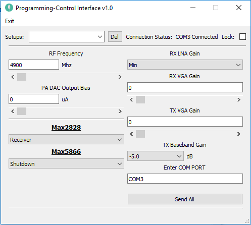

**PC – RF CONTROLLER SERIAL COMMUNICATION GUI**

VENTSPILS INTERNATIONAL RADIOASTRONOMY CENTER

VENTSPILS UNIVERSITY COLLEGE APPLIED SCIENCE

09/2018

1. **INTRODUCTION**

The MAX2828/MAX5688 (\*) single-chip, RF transceiver ICs are designed specifically for OFDM 802.11 WLAN applications. In this program, the main goal is communicate between PC and RF Controller.

In this purpose, we have done Graphical User Interface

In this document, we use MW instead of Max2828\_Window.py and MWE instead of Max2828\_WindowEdit.py. Codes written italic.

1. **PARTS OF GUI**

**Programming-Control Interface v1.0**
There is the main title. Also there is an application icon.

You can change the icon in main directory or you can change it with this code in MW:

_icon = QtGui.QIcon()_

_icon.addPixmap(QtGui.QPixmap("icon.png"), QtGui.QIcon.Normal, QtGui.QIcon.Off)_

_MainWindow.setWindowIcon(icon)_

You can change the main title from this code line from MW:

_MainWindow.setWindowTitle(\_translate("MainWindow", "Programming-Control Interface v1.0"))_

**Setups:**

This part is belong to Setups Combo box. You can save your sets to database. As default, Last Power Down. It takes last data when you shut down.

Name of check box: **Setups\_ComboBox**

**Connection Status:**

This label shows connected device (Com Port) and connection status. COM3 is default.

Label Name: C **onnection\_Label**.

You can change the text with this code under MWE:

_ui.Connection\_Label.setText(self.con.name +" Connected")_

**Lock:**

This checkbox disables all parts of app without send all button.

Name of check box: **Lock\_CheckBox**

**RF Frequency:**

The value must be between of 4900-5900. You can change the value by scrollbar or text line. If you enter value smaller than 4900, the value will be 4900. If you enter value greater than 5900, the value will be 5900.

Name of Text Line: **RFFrequency\_Line**

Name of Scroll Bar: **RFFrequency\_ScrollBar**

**PA DAC Output Bias:**

The value must be between of 0-315. You can change the value by scrollbar or text line. If you enter value smaller than zero, the value will be zero. If you enter value greater than 315, the value will be 315.

Name of Text Line: **PADACOutputBias\_Line**

Name of Scroll Bar: **PADACOutputBias\_ ScrollBar**

**RX VGA GAIN:**

The value must be between of 0-31. You can change the value by scrollbar or text line. If you enter value smaller than zero, the value will be zero. If you enter value greater than 31, the value will be 31.

Name of Text Line: **RXVGAGain\_Line**

Name of Scroll Bar: **RXVGAGain\_ ScrollBar**

**TX VGA GAIN:**

The value must be between of 0-63. You can change the value by scrollbar or text line. If you enter value smaller than zero, the value will be zero. If you enter value greater than 63, the value will be 63.

Name of Text Line: **TXVGAGain\_Line**

Name of Scroll Bar: **TXVGAGain\_ ScrollBar**

**RX LNA GAIN:**

There are 3 values. Min, Mid and Max. Respectively values of them: 0, 1 and 2. You cannot add options to combo box and you cannot edit them.

Name of Combo Box: **RXLNAGain\_ComboBox**

**TX Baseband GAIN:**

There are 2 values. -5.0 and Max Gain. Respectively values of them: 0 and 1. You cannot add options to combo box and you cannot edit them.

Name of Combo Box: **TXBasebandGain\_ComboBox**

**MAX2828**** :**

There are 4 modes. Receiver, Transmitter, IDLE and Standby. Respectively 0, 1, 2 and 3. You cannot add options to combo box and you cannot edit them.

Name of Combo Box: **Max2828\_ComboBox**

**MAX5866**** :**

There are 5 modes. Shutdown, IDLE, RX, TX and Standby. Respectively 0, 1, 2, 3 and 4.

Name of Combo Box: **Max5866\_ComboBox**

**Enter COM Port:**

COM3 set as default. You can change your COM Port. You have to check your settings for learn it. If you enter wrong thing, app does not work.

Name of Text Line: **ComPort\_Line**

**Send All:**

This button sends all packages.

Name of Button: **SendAll\_Button**

1. **COMMUNICATION – PACKAGES**

App consists 7 packages and each package consists 12 bytes.

| Starter Byte      | Source Byte | Destination Byte(*) | Command Byte | Data Byte 1 | Data Byte 2 | Byte 7 - Byte 12 |
| ------------------ | ------------| --------------------- | --------------| ------------| ------------| ----------------- |
| RF Frequency      | 0XAA        | 0X01                 | 0X02 / 0X03   | 0X01         |              | 0X00              |
| PA DAC Output Bias | 0XAA        | 0X01                 | 0X02 / 0X03   | 0X02         |              | 0X00              |
| RX VGA GAIN        | 0XAA        | 0X01                 | 0X02 / 0X03   | 0X03         |              | 0X00              |
| TX VGA GAIN        | 0XAA        | 0X01                 | 0X02 / 0X03   | 0X04         |              | 0X00              |
| RX LNA GAIN        | 0XAA        | 0X01                 | 0X02 / 0X03   | 0X05         |              | 0X00              |
| TX Baseband GAIN   | 0XAA        | 0X01                 | 0X02 / 0X03   | 0X06         |              | 0X00              |
| Max2828/Max5866    | 0XAA        | 0X01                 | 0X02 / 0X03   | 0X07         |              | 0X00              |

[\*] Max2828 is 0X02 and Max 5866 is 0X03. As default Max2828.

Minimum and maximum values for pack datas:

Note: For RF Frequency and PA DAC Output Bias, they are using 2 bytes. For others, Data Byte 1 is zero byte and Data Byte 2 consists data.

| Parameter          | Minimum Value | Maximum Value |
| ------------------ | ------------- | ------------- |
| RF Frequency      | 0X1324         | 0X170C         |
| PA DAC Output Bias | 0X00           | 0X200          |
| RX VGA GAIN        | 0X00           | 0X20           |
| TX VGA GAIN        | 0X00           | 0X40           |
| RX LNA GAIN        | 0X00           | 0X02           |
| TX Baseband GAIN   | 0X00           | 0X01           |
| Max2828            | 0X00           | 0X03           |
| Max5866            | 0X00           | 0X04           |

For Example:

| Parameter          | Value (DEC) | Value (HEX) | Data Byte 1 | Data Byte 2 |
| ------------------ | ------------ | ----------- | ----------- | ----------- |
| RF Frequency      | 4900         | 0X1324      | 0X13        | 0X24        |
| PA DAC Output Bias | 0            | 0X00        | 0X01        | 0XFF        |
| RX VGA GAIN        | 0            | 0X00        | 0X00        | 0X20        |
| TX VGA GAIN        | 0            | 0X00        | 0X00        | 0X40        |
| RX LNA GAIN        | 0            | 0X00        | 0X00        | 0X02        |
| TX Baseband GAIN   | 0            | 0X00        | 0X00        | 0X01        |
| Max2828            | 0            | 0X00        | 0X00        | 0X03        |
| Max5866            | 0            | 0X00        | 0X00        | 0X04        |

1. **PROGRAMMING**

1. **Python Side**

App GUI created with PyQt5. Name of Main GUI file is **Max2828\_Window.py** as this document **(MW)**.

In addition, name of we created Python file is **Max2828\_WindowEdit.py** as this document **(MWE)**.

**Max2828\_Window:**

**Classes:**

- _class Ui\_MainWindow(object):_

**Class Functions:**

- _def setupUi(self, MainWindow):_

It starts Graphical User Interface. You can add – remove items under this function.

- _def retranslateUi(self, MainWindow):_

You can translate or rename the objects with this function.

- _def close\_application(self):_

It closes the application.

- _def callMain(self):_

It returns Main Window.

- _def ScrollBarValue(self, ScrollBarName, LineEditName):_

It sets Text Lines as same with ScrollBar

- def CheckingLines(self, ScrollBarName, LineEditName):

It checks text lines for is it greater than maximum value or smaller than minimum value.

**Max2828\_WindowEdit:**

**Classes:**

- _class WindowEdit(object):_

**Functions:**

- _def checkLock(self,ui):_

This function checks Lock\_CheckBox. If check box checked, function disables all objects. If check box not checked, function enables all objects.

- _def checkDevice(self,ui):_

This function checks connection. If device available, Connection\_Label writes **"Name of device" + connected**. If device is not connected, label writes **"Disconnected".**

- _def SerialConnection(self,ui):_

It connects to Serial Device.

- _def SaveDB(self, ui, nameofDB):_

This function saves data to Database.

- _def PrintDB(self):_

This function prints database items to Python console.

- _def ReceiveDB(self,ui, nameofDB):_

This function takes data from database.

- _def send(self,PackageList):_

When you press Send button, this function sends all bytes to serial port.

- _def try3Times (self,PackageList):_

If in program occurs any problem, this function sends bytes again and waits back.

- _def receive(self,PackageList):_

When device responses, program receives bytes with this code. Each byte pack is set 12 bytes.

**Note:** We don't call this function. It is working but we don't need receive pack what 12 bytes.

- def receiveAck(self,PackageList):

When you send packs, device responses to PC with acknowledgement. This function takes acknowledgement packs. Table of acknowledgement:

| Parameter          | Starter Byte | Source Byte (*) | Destination Byte | Command Byte | Truth Byte |
| ------------------ | ------------ | --------------- | ----------------- | ------------ | ---------- |
| RF Frequency      | 0XAA         | 0X02 / 0X03      | 0X01              | 0X01         | 0X00/0X01  |
| PA DAC Output Bias | 0XAA         | 0X02 / 0X03      | 0X01              | 0X02         | 0X00/0X01  |
| RX VGA GAIN        | 0XAA         | 0X02 / 0X03      | 0X01              | 0X03         | 0X00/0X01  |
| TX VGA GAIN        | 0XAA         | 0X02 / 0X03      | 0X01              | 0X04         | 0X00/0X01  |
| RX LNA GAIN        | 0XAA         | 0X02 / 0X03      | 0X01              | 0X05         | 0X00/0X01  |
| TX Baseband GAIN   | 0XAA         | 0X02 / 0X03      | 0X01              | 0X06         | 0X00/0X01  |
| Max2828/ Max5866   | 0XAA         | 0X02 / 0X03      | 0X01              | 0X07         | 0X00/0X01  |

[\*] Max2828 is 0X02 and Max 5866 is 0X03. As default Max2828.

- _def sendandReceive(self, PackageList):_

This function calls send function and receive function together.

- _def des2828(self):_

It sets destination byte as 0x02

- _def des5866(self):_

It sets destination byte as 0x03

- _def checktoDestination(self):_

If destination byte is 0x02, this function sends Max2626 pack. If destination byte is 0x03, this function sends Max5866 pack.

- _def ValuetoHex(self,ui):_

This prepares packs. Converts to hexademical.

Used items and item properties:

| Object Type        | Object ID                                                                                           |
| ------------------ | ---------------------------------------------------------------------------------------------------- |
| Central Widget     | MainWindow                                                                                          |
| Buttons            | SendAll_Button, Del_Button                                                                           |
| Combo Boxes        | Setups_ComboBoxRXLNAGain_ComboBoxTXBasebandGain_ComboBoxSetups_ComboBoxMax2828_ComboBoxMax5866_ComboBox |
| Scroll Bars        | RFFrequency_ScrollBar, PADACOutputBias_ScrollBar, RXVGAGain_ScrollBar, TXVGAGain_ScrollBar              |
| Line Edits         | RFFrequency_Line, PADACOutputBias_Line, RXVGAGain_Line, TXVGAGain_Line, ComPort_Line                   |
| Labels             | Lock_Label, ConnectionStatus_Label, Connection_Label, Setups_Label, RFFrequency_Label, PADACOutputBias_Label, Max2828_TopLabel, Max5866_TopLabel, PADACOutputBias_TopLabel, RFFrequency_TopLabel, TXBasebandGain_Label, RXLNAGain_TopLabel, RXVGAGain_TopLabel, TXBasebandGain_TopLabel, TXVGAGain_TopLabel |
| Check Box          | Lock_CheckBox                                                                                        |
| Layouts            | VerticalLayout_1, VerticalLayout_2, TXBasebandGain_Layout, TopSide_HorizontalLayout, RFFrequency_Layout, PADACOutputBias_Layout |
| Spacers            | verticalSpacer, verticalSpacer_2, horizontalSpacer, horizontalSpacer_2                               |
| Lines              | Line, Line_2, Line_3, Line_4                                                                       |
| Icon               | icon                                                                                               |
